How to improve your viz in R with less
========================================================
author: Dr. Ulf Schepsmeier
date: 
autosize: true

Background
========================================================

- working for Allianz Technology since 4 years as head of a small AI team
- working with **R**
- building dashboards with **Shiny**
- giving presentations to management and talks on conferences  
- like to work with ML, AI, Big Data,...  
- **viz enthusiast**

Better to learn **one** programming language **good** (in deep) then to know just a **little** in **many** programming languages.  
=> today just **R**

Intention of this talk
========================================================

How can I improve my viz although I have no time for it?

<center>
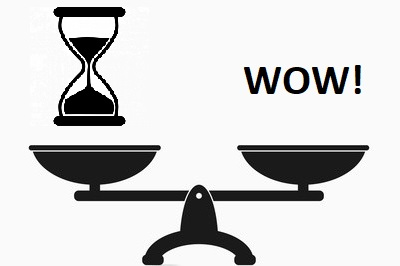
</center>

Intention of this talk II
========================================================

- Think about the **intention** first
- What is **important**? 
  * A single number
  * Comparison of several numbers
  * whole time series
  * relative or absolute numbers
- Make small improvements to your viz
- Step-by-step improvements

I will present a collection of **Tips and Tricks** I found myself or in blog posts, stack overflow, conferences ,...  


========================================================

<center>
# Tip 1: Highlighting rows and columns in tables
</center>

========================================================


```r
library(DT)
DT::datatable(iris, options = list(pageLength = 10))
```


========================================================


```r
datatable(iris) %>% 
  formatStyle('Sepal.Length', fontWeight = styleInterval(5, c('normal', 'bold')))
```

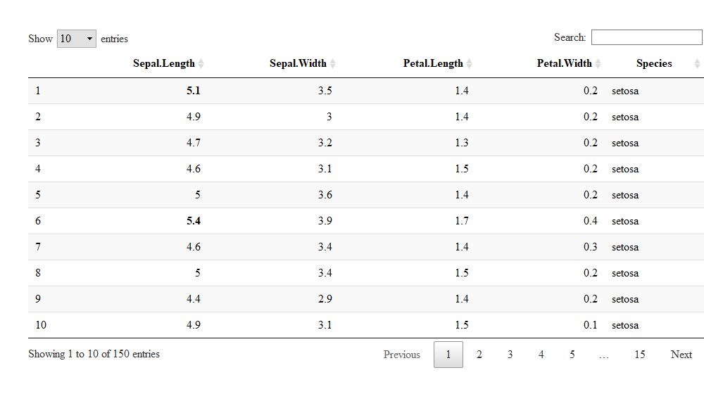

========================================================

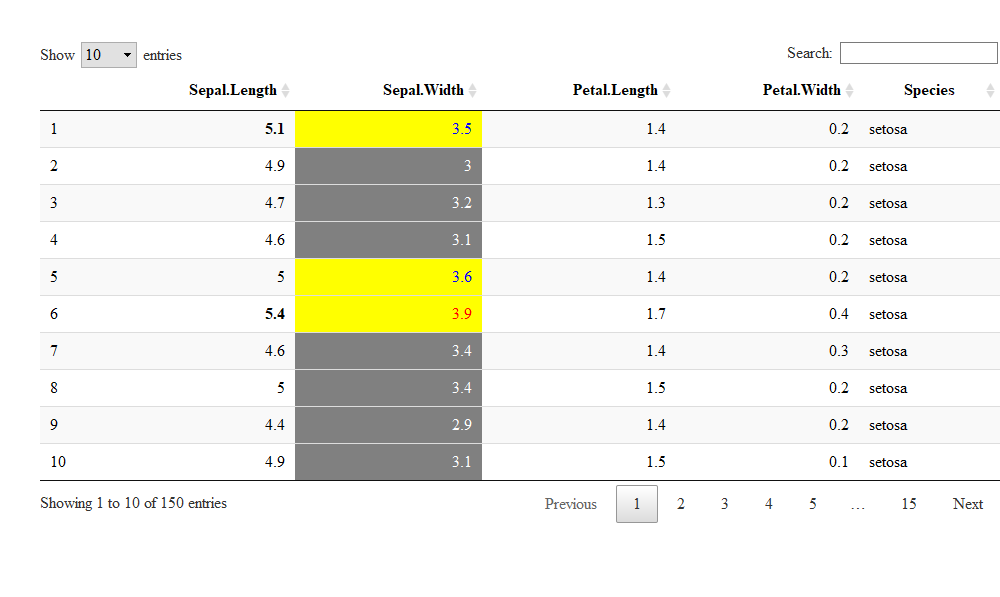

========================================================


```r
datatable(iris) %>% 
  formatStyle('Sepal.Length', fontWeight = styleInterval(5, c('normal', 'bold'))) %>%
  formatStyle(
    'Sepal.Width',
    color = styleInterval(c(3.4, 3.8), c('white', 'blue', 'red')),
    backgroundColor = styleInterval(3.4, c('gray', 'yellow'))
  )
```

========================================================

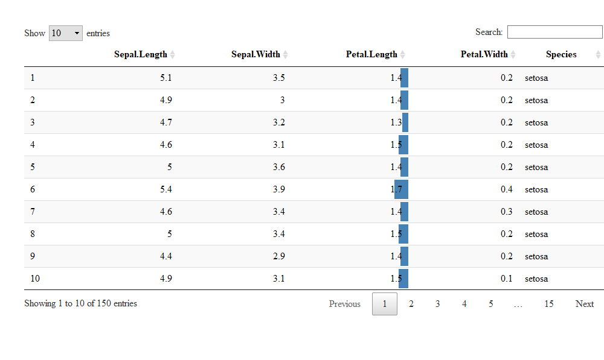

========================================================


```r
datatable(iris) %>% 
  formatStyle(
    'Petal.Length',
    background = styleColorBar(iris$Petal.Length, 'steelblue'),
    backgroundSize = '100% 90%',
    backgroundRepeat = 'no-repeat',
    backgroundPosition = 'center'
  )
```

========================================================

<center>
# Tip 2: Formatting columns in tables
</center>

========================================================


```r
m = cbind(matrix(rnorm(60, 1e4, 1e5), 20), runif(20), rnorm(20, 100))
m[, 1:3] = round(m[, 1:3])
m[, 4:5] = round(m[, 4:5], 5)
colnames(m) = head(LETTERS, ncol(m))
head(m)
```

```
           A       B       C       D         E
[1,]  145213  183029  -45220 0.71058 101.29599
[2,] -109831   24225  -97899 0.43516 101.66112
[3,]   63711  -77456   62112 0.97398 100.46863
[4,] -208346  137244  -43004 0.58191 100.25043
[5,]  138039 -126521 -107587 0.75416  99.46394
[6,]  -80804 -189272  -14663 0.56426 100.19776
```

========================================================

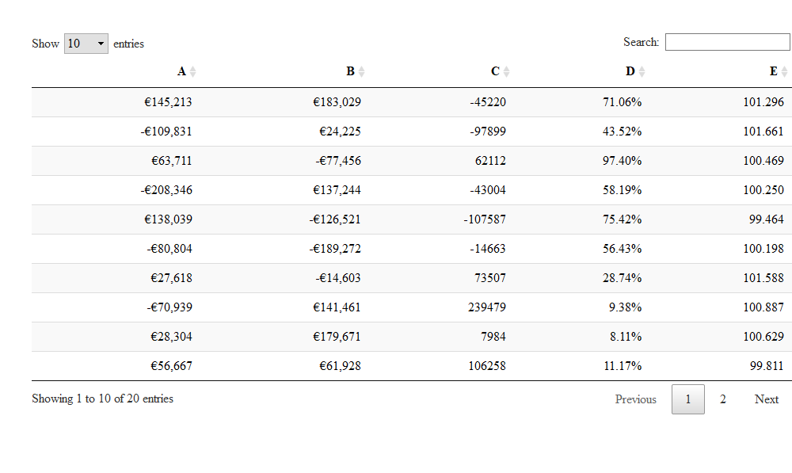

========================================================


```r
# format the columns A and C as currency, and D as percentages
datatable(m) %>% formatCurrency(c('A', 'C')) %>% formatPercentage('D', 2)

# the first two columns are Euro currency, and round column E to 3 decimal places
datatable(m) %>% formatCurrency(1:2, '\U20AC', digits = 0) %>% formatRound('E', 3)
```


Formatting of DT
========================================================

- use functions `formatStyle(), formatCurrency(), formatPercentage(), formatDate()`
- bold, italic, font size, font color
- background color, "bar chart"
- row names, col names, table header

[https://rstudio.github.io/DT/functions.html](https://rstudio.github.io/DT/functions.html)


========================================================

<center>
# Tip 3: Highlighting rows and columns in tables \#2
</center>


Package: formattable
========================================================

Example:


<table class="table table-condensed">
 <thead>
  <tr>
   <th style="text-align:left;"> Indicator Name </th>
   <th style="text-align:center;"> 2011 </th>
   <th style="text-align:center;"> 2012 </th>
   <th style="text-align:center;"> 2013 </th>
   <th style="text-align:center;"> 2014 </th>
   <th style="text-align:center;"> 2015 </th>
   <th style="text-align:center;"> 2016 </th>
   <th style="text-align:center;"> Average </th>
   <th style="text-align:right;"> Improvement </th>
  </tr>
 </thead>
<tbody>
  <tr>
   <td style="text-align:left;"> <span style="color: grey; -weight: bold">Prevalence of Obesity               </span> </td>
   <td style="text-align:center;"> <span style="display: block; padding: 0 4px; border-radius: 4px; background-color: #def7e9">19.1</span> </td>
   <td style="text-align:center;"> <span style="display: block; padding: 0 4px; border-radius: 4px; background-color: #def7e9">23.6</span> </td>
   <td style="text-align:center;"> <span style="display: block; padding: 0 4px; border-radius: 4px; background-color: #def7e9">23.3</span> </td>
   <td style="text-align:center;"> <span style="display: block; padding: 0 4px; border-radius: 4px; background-color: #def7e9">20.5</span> </td>
   <td style="text-align:center;"> <span style="display: block; padding: 0 4px; border-radius: 4px; background-color: #def7e9">24.0</span> </td>
   <td style="text-align:center;"> <span style="display: block; padding: 0 4px; border-radius: 4px; background-color: #def7e9">23.2</span> </td>
   <td style="text-align:center;"> <span style="display: inline-block; direction: rtl; border-radius: 4px; padding-right: 2px; background-color: #ff7f7f; width: 100.00%">22.28</span> </td>
   <td style="text-align:right;"> <span style="-weight: bold; color: #ff7f7f">
  <i class="glyphicon glyphicon-arrow-down"></i>
  -21.47
</span> </td>
  </tr>
  <tr>
   <td style="text-align:left;"> <span style="color: grey; -weight: bold">Prevalence of Tobacco Use           </span> </td>
   <td style="text-align:center;"> <span style="display: block; padding: 0 4px; border-radius: 4px; background-color: #d0f1df">17.4</span> </td>
   <td style="text-align:center;"> <span style="display: block; padding: 0 4px; border-radius: 4px; background-color: #abe2c3">15.0</span> </td>
   <td style="text-align:center;"> <span style="display: block; padding: 0 4px; border-radius: 4px; background-color: #b6e6ca">15.3</span> </td>
   <td style="text-align:center;"> <span style="display: block; padding: 0 4px; border-radius: 4px; background-color: #a5dfbe">12.2</span> </td>
   <td style="text-align:center;"> <span style="display: block; padding: 0 4px; border-radius: 4px; background-color: #b3e5c9">16.6</span> </td>
   <td style="text-align:center;"> <span style="display: block; padding: 0 4px; border-radius: 4px; background-color: #b4e5c9">16.7</span> </td>
   <td style="text-align:center;"> <span style="display: inline-block; direction: rtl; border-radius: 4px; padding-right: 2px; background-color: #ff7f7f; width: 69.70%">15.53</span> </td>
   <td style="text-align:right;"> <span style="-weight: bold; color: #71CA97">
  <i class="glyphicon glyphicon-arrow-up"></i>
  4.02
</span> </td>
  </tr>
  <tr>
   <td style="text-align:left;"> <span style="color: grey; -weight: bold">Prevalence of Cardiovascular Disease</span> </td>
   <td style="text-align:center;"> <span style="display: block; padding: 0 4px; border-radius: 4px; background-color: #71ca97">5.0</span> </td>
   <td style="text-align:center;"> <span style="display: block; padding: 0 4px; border-radius: 4px; background-color: #71ca97">4.9</span> </td>
   <td style="text-align:center;"> <span style="display: block; padding: 0 4px; border-radius: 4px; background-color: #71ca97">1.5</span> </td>
   <td style="text-align:center;"> <span style="display: block; padding: 0 4px; border-radius: 4px; background-color: #71ca97">4.4</span> </td>
   <td style="text-align:center;"> <span style="display: block; padding: 0 4px; border-radius: 4px; background-color: #71ca97">4.9</span> </td>
   <td style="text-align:center;"> <span style="display: block; padding: 0 4px; border-radius: 4px; background-color: #71ca97">6.2</span> </td>
   <td style="text-align:center;"> <span style="display: inline-block; direction: rtl; border-radius: 4px; padding-right: 2px; background-color: #ff7f7f; width: 20.11%">4.48</span> </td>
   <td style="text-align:right;"> <span style="-weight: bold; color: #ff7f7f">
  <i class="glyphicon glyphicon-arrow-down"></i>
  -24
</span> </td>
  </tr>
  <tr>
   <td style="text-align:left;"> <span style="color: grey; -weight: bold">Prevalence of Diabetes              </span> </td>
   <td style="text-align:center;"> <span style="display: block; padding: 0 4px; border-radius: 4px; background-color: #88d3a8">8.0</span> </td>
   <td style="text-align:center;"> <span style="display: block; padding: 0 4px; border-radius: 4px; background-color: #7ecfa1">7.2</span> </td>
   <td style="text-align:center;"> <span style="display: block; padding: 0 4px; border-radius: 4px; background-color: #98dab4">9.3</span> </td>
   <td style="text-align:center;"> <span style="display: block; padding: 0 4px; border-radius: 4px; background-color: #83d1a5">7.2</span> </td>
   <td style="text-align:center;"> <span style="display: block; padding: 0 4px; border-radius: 4px; background-color: #7fd0a2">7.5</span> </td>
   <td style="text-align:center;"> <span style="display: block; padding: 0 4px; border-radius: 4px; background-color: #8bd5ab">10.4</span> </td>
   <td style="text-align:center;"> <span style="display: inline-block; direction: rtl; border-radius: 4px; padding-right: 2px; background-color: #ff7f7f; width: 37.12%">8.27</span> </td>
   <td style="text-align:right;"> <span style="-weight: bold; color: #ff7f7f">
  <i class="glyphicon glyphicon-arrow-down"></i>
  -30
</span> </td>
  </tr>
</tbody>
</table>


[https://www.r-bloggers.com/create-stylish-tables-in-r-using-formattable/amp/](https://www.r-bloggers.com/create-stylish-tables-in-r-using-formattable/amp/)  
  
  
[https://www.r-bloggers.com/make-beautiful-tables-with-the-formattable-package/amp/](https://www.r-bloggers.com/make-beautiful-tables-with-the-formattable-package/amp/)


Package: formattable
========================================================

<br>
Most important function: `formatter("span", style = ~ style(...))`  


- Column alignment (argument `align`)
- formating with `percent(), currency(), comma(), ...`
- Use color `color_bar(), color_text(), color_tile()`
- Add icons `icontext()`
- and much more


Package: formattable
========================================================

Sometimes it is useful to use arrows to show statistical significance. While formattable is not super flexible in this regard, it can do a good job nonetheless. 


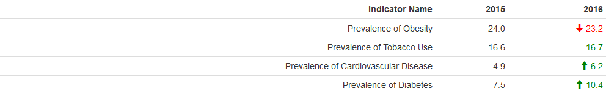

Which icons are possible: see [Glyphicons in Bootstrap](https://getbootstrap.com/docs/3.3/components/), [Glyphicons](https://www.glyphicons.com/)


```r
icontext("plus")
icontext(c("star","star-empty"))
```


Package: formattable
========================================================

The sparklines package can be used to create sparklines.  
The way that we do this is by converting the sparkline into text (character(htmltools::as.tags), and then telling the formattable HTML widget that it also contains sparklines.


```r
prevalence$`2012` = apply(prevalence[, 2:7], 1, FUN = function(x) as.character(htmltools::as.tags(sparkline(as.numeric(x), type = "line"))))
```


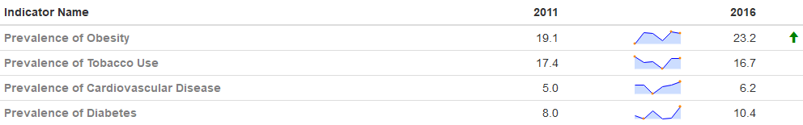

Possible sparklines: bar, line, bullet, pie, tristate and discrete


Package: formattable - Little trick for Rmarkdown
========================================================


```r
# Export a Formattable as PNG, PDF, or JPEG

library(htmltools)
library(webshot)

export_formattable <- function(f, file, width = "100%", height = NULL, 
                               background = "white", delay = 0.2){
  w <- as.htmlwidget(f, width = width, height = height)
  path <- html_print(w, background = background, viewer = NULL)
  url <- paste0("file:///", gsub("\\\\", "/", normalizePath(path)))
  webshot(url, file = file,
          selector = ".formattable_widget",
          delay = delay)
}
```

[https://stackoverflow.com/questions/34983822/how-to-have-r-formattable-rendered-to-pdf-output-and-how-to-have-percents-in-the](https://stackoverflow.com/questions/34983822/how-to-have-r-formattable-rendered-to-pdf-output-and-how-to-have-percents-in-the)

========================================================

<center>
# Tip 4: Paper ready tables
</center>

Paper ready tables
========================================================

<center>
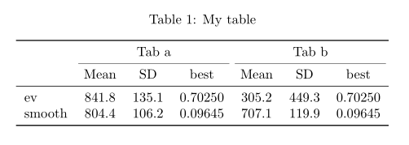
</center>

[https://stackoverflow.com/questions/44324042/r-xtable-with-multicolumns-and-booktabs](https://stackoverflow.com/questions/44324042/r-xtable-with-multicolumns-and-booktabs)  
[http://haozhu233.github.io/kableExtra/awesome_table_in_pdf.pdf](http://haozhu233.github.io/kableExtra/awesome_table_in_pdf.pdf)

Similar: [http://cameron.bracken.bz/sweave-xtable-booktabs](http://cameron.bracken.bz/sweave-xtable-booktabs)

========================================================


```r
library(kableExtra)
options(knitr.table.format = "latex")

dat <- structure(c(841.8, 804.4, 135.1, 106.2, 0.7025, 0.09645, 305.2, 
707.1, 449.3, 119.9, 0.7025, 0.09645), 
.Dim = c(2L, 6L), 
.Dimnames = list(c("ev", "smooth"), 
                 c("Mean", "SD", "best", "Mean", "SD", "best"))
)

kable(dat, booktabs = TRUE, caption = "My table", align = "c") %>% 
  add_header_above(c(" ", "Tab a" = 3, "Tab b" = 3)) %>% 
    kable_styling(latex_options = "hold_position")
```


========================================================

<center>
# Tip 5: Label line ends in time series with ggplot2
</center>

Label line ends in time series with ggplot2
========================================================

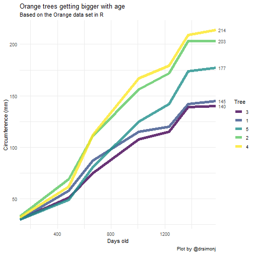


========================================================

Package: `ggplot2`

Function: `scale_y_continuous(sec.axis = sec_axis(...))`

[https://www.r-bloggers.com/create-stylish-tables-in-r-using-formattable/amp/](https://www.r-bloggers.com/create-stylish-tables-in-r-using-formattable/amp/)


========================================================

<center>
# Tip 6: Annotations in plots
</center>

Annotations in plots
========================================================

In general annotations in plots are no difficult task to do in R.
In *base* plots it is `text()` or `mtext()` and in *ggplot2* `geom_text()`.
So far so good. But *ggplot2* we can have multiple plots with facets (`facet_grid()`). What if we want different annotations in each plot?

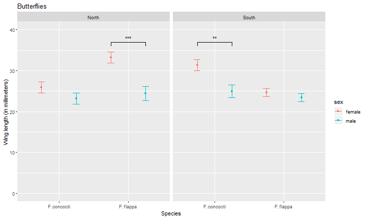

Adding different annotation to each facet in ggplot
========================================================

I guess it is quite easy to get something like this:

```r
ggplot(data=buttersum, aes(x=spp, y=winglen)) +
  geom_point(aes(colour=sex), position = position_dodge(width = 1)) +
  geom_errorbar(aes(colour=sex, ymin=winglen-se, ymax=winglen+se), 
                width = .2, position = position_dodge(width = 1)) + 
  ylim(0, 40) + facet_grid(. ~ region) 
```

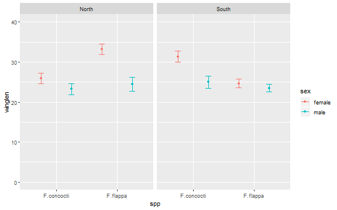

Adding different annotation to each facet in ggplot
========================================================

The easiest way to annotate for each facet separately is to create a dataframe with a row for each facet:

<center>
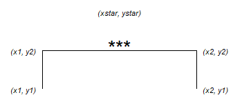
</center>

```r
anno <- data.frame(x1 = c(1.75, 0.75), x2 = c(2.25, 1.25), 
                   y1 = c(36, 36), y2 = c(37, 37), 
                   xstar = c(2, 1), ystar = c(38, 38),
                   lab = c("***", "**"),
                   region = c("North", "South"))
```


Adding different annotation to each facet in ggplot
========================================================

And then add the annotation to the plot:

```r
ggplot(data = buttersum, aes(x = spp, y = winglen)) +
  geom_point(aes(colour=sex), position = position_dodge(width=1)) +
  geom_errorbar(aes(colour=sex, ymin=winglen-se, ymax=winglen+se), 
                width = .2, position = position_dodge(width = 1)) +
  ylim(0, 40) +
  geom_text(data = anno, aes(x = xstar,  y = ystar, label = lab)) +
  geom_segment(data = anno, aes(x = x1, xend = x1, y = y1, yend = y2),
           colour = "black") +
  geom_segment(data = anno, aes(x = x2, xend = x2, y = y1, yend = y2),
           colour = "black") +
  geom_segment(data = anno, aes(x = x1, xend = x2, y = y2, yend = y2),
           colour = "black")+
  facet_grid(. ~ region) +
  ggtitle("Butterflies") +
  xlab("Species") + ylab("Wing length (in millimeters)")
```

From [https://www.r-bloggers.com/adding-different-annotation-to-each-facet-in-ggplot/](https://www.r-bloggers.com/adding-different-annotation-to-each-facet-in-ggplot/)

========================================================

<center>
# Tip 7: Dashboards: Use gauges to visualize single numbers with levels
</center>

========================================================


```r
library(flexdashboard)

gauge(42, min = 0, max = 100, symbol = '%', gaugeSectors(
  success = c(80, 100), warning = c(40, 79), danger = c(0, 39)
))
```

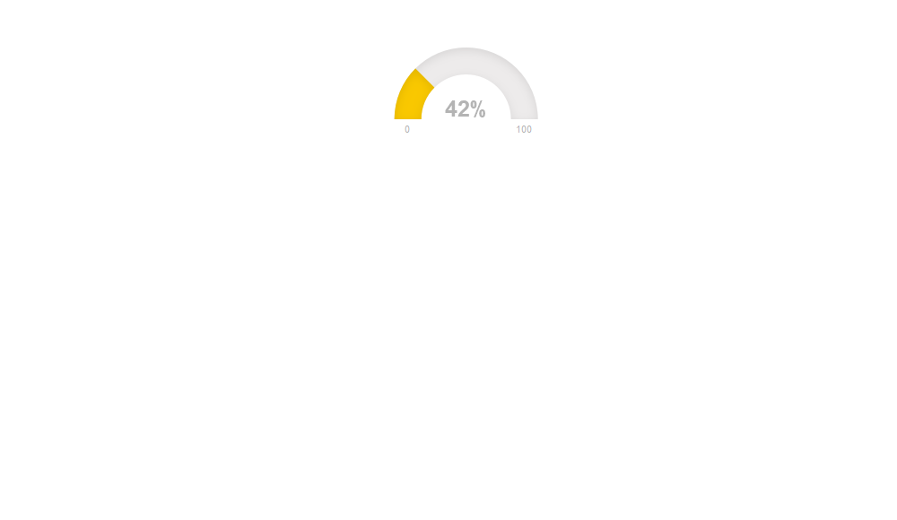

========================================================

Hier noch das Bsp aus der Shiny App
