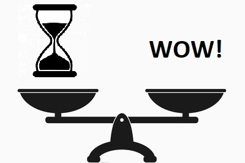
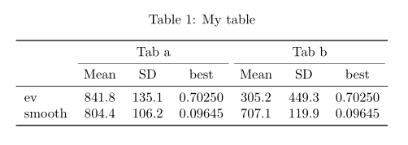

## Background

- working for Allianz Technology since 4 years as head of a small AI team
- working with **R**
- building dashboards with **Shiny**
- giving presentations to management and talks on conferences  
- like to work with ML, AI, Big Data,...  
- **viz enthusiast**

Better to learn **one** programming language **good** (in deep) then to know just a **little** in **many** programming languages.  
=> today just **R**


## Intention of this talk

How can I improve my viz although I have no time for it?

<center>

</center>

## Intention of this talk II

- Think about the **intention** first
- What is **important**? 
  * A single number
  * Comparison of several numbers
  * whole time series
  * relative or absolute numbers
- Make small improvements to your viz
- Step-by-step improvements

I will present a collection of **Tips and Tricks** I found myself or in blog posts, stack overflow, conferences ,...  


# Tip 0: Get inspired

## Get inspired

The R Graph Gallery: [https://www.r-graph-gallery.com/](https://www.r-graph-gallery.com/)

Top 50 ggplot2 Visualizations - The Master List: [http://r-statistics.co/Top50-Ggplot2-Visualizations-MasterList-R-Code.html](http://r-statistics.co/Top50-Ggplot2-Visualizations-MasterList-R-Code.html)

R-bloggers: [https://www.r-bloggers.com/](https://www.r-bloggers.com/)

Stack overflow [https://stackoverflow.com/questions/tagged/r+plot](https://stackoverflow.com/questions/tagged/r+plot)


# Tip 1: Highlighting rows and columns in tables

---

```{r}
library(DT)
DT::datatable(iris, options = list(pageLength = 5))
```

---

```{r}
datatable(iris, options = list(pageLength = 5)) %>% 
  formatStyle('Sepal.Length', fontWeight = styleInterval(5, c('normal', 'bold')))
```

---

```{r, echo=FALSE}
datatable(iris) %>% 
  formatStyle('Sepal.Length', fontWeight = styleInterval(5, c('normal', 'bold'))) %>%
  formatStyle(
    'Sepal.Width',
    color = styleInterval(c(3.4, 3.8), c('white', 'blue', 'red')),
    backgroundColor = styleInterval(3.4, c('gray', 'yellow'))
  )
```

---

```{r, eval=FALSE}
datatable(iris) %>% 
  formatStyle('Sepal.Length', fontWeight = styleInterval(5, c('normal', 'bold'))) %>%
  formatStyle(
    'Sepal.Width',
    color = styleInterval(c(3.4, 3.8), c('white', 'blue', 'red')),
    backgroundColor = styleInterval(3.4, c('gray', 'yellow'))
  )
```

---

```{r, echo=FALSE}
datatable(iris) %>% 
  formatStyle(
    columns = 'Petal.Length',
    background = styleColorBar(iris$Petal.Length, 'steelblue'),
    backgroundSize = '100% 90%',
    backgroundRepeat = 'no-repeat',
    backgroundPosition = 'center'
  )
```

---

```{r, eval=FALSE}
datatable(iris) %>% 
  formatStyle(
    'Petal.Length',
    background = styleColorBar(iris$Petal.Length, 'steelblue'),
    backgroundSize = '100% 90%',
    backgroundRepeat = 'no-repeat',
    backgroundPosition = 'center'
  )
```


# Tip 2: Formatting columns in tables

---

```{r}
m = cbind(matrix(rnorm(60, 1e4, 1e5), 20), runif(20), rnorm(20, 100))
m[, 1:3] = round(m[, 1:3])
m[, 4:5] = round(m[, 4:5], 5)
colnames(m) = head(LETTERS, ncol(m))
head(m)
```

---

```{r, echo=FALSE}
datatable(m) %>% formatCurrency(1:2, '\U20AC', digits = 0) %>% formatRound('E', 3) %>% formatPercentage('D', 2)
```


## Formatting of DT

- use functions `formatStyle(), formatCurrency(), formatPercentage(), formatDate()`
- bold, italic, font size, font color
- background color, "bar chart"
- row names, col names, table header

```{r, eval=FALSE}
# format the columns A and C as currency, and D as percentages
datatable(m) %>% formatCurrency(c('A', 'C')) %>% formatPercentage('D', 2)

# the first two columns are Euro currency, and round column E to 3 decimal places
datatable(m) %>% formatCurrency(1:2, '\U20AC', digits = 0) %>% formatRound('E', 3)
```

[https://rstudio.github.io/DT/functions.html](https://rstudio.github.io/DT/functions.html)


# Tip 3: Highlighting rows and columns in tables \#2


## Package: formattable

Example:

```{r, echo=FALSE}
suppressMessages(library(data.table))
suppressMessages(library(plyr))
suppressMessages(library(dplyr))
suppressMessages(library(formattable))
suppressMessages(library(tidyr))

#Set a few color variables to make our table more visually appealing
customGreen0 = "#DeF7E9"
customGreen = "#71CA97"
customRed = "#ff7f7f"
load("austinData.RData")

i1 <- austinData %>%
  filter(`Indicator Name` %in% 
           c('Prevalence of Obesity', 'Prevalence of Tobacco Use', 
             'Prevalence of Cardiovascular Disease', 'Prevalence of Diabetes')) %>%
  select(c(`Indicator Name`, `2011`, `2012`, `2013`, `2014`, `2015`, `2016`)) %>%
  mutate (Average = round(rowMeans(
    cbind(`2011`, `2012`, `2013`, `2014`, `2015`, `2016`), na.rm=TRUE),2), 
    `Improvement` = round((`2011`-`2016`)/`2011`*100,2))

# View the table data in it’s raw format
#i1

improvement_formatter <- formatter("span", 

                                   style = x ~ style(.weight = "bold", 

                                                     color = ifelse(x > 0, customGreen, ifelse(x < 0, customRed, "black"))), 

                                   x ~ formattable::icontext(ifelse(x>0, "arrow-up", "arrow-down"), x)

                                   )

formattable(i1, align =c("l","c","c","c","c", "c", "c", "c", "r"), list(

  `Indicator Name` = formatter("span", style = ~ style(color = "grey",.weight = "bold")), 

  `2011`= color_tile(customGreen, customGreen0),

  `2012`= color_tile(customGreen, customGreen0),

  `2013`= color_tile(customGreen, customGreen0),

  `2014`= color_tile(customGreen, customGreen0),

  `2015`= color_tile(customGreen, customGreen0),

  `2016`= color_tile(customGreen, customGreen0),

  `Average` = color_bar(customRed),

  `Improvement` = improvement_formatter

))


```


## Package: formattable

Most important function: `formatter("span", style = ~ style(...))`  


- Column alignment (argument `align`)
- formatting with `percent(), currency(), comma(), ...`
- Use color `color_bar(), color_text(), color_tile()`
- Add icons `icontext()`
- and much more

<br><br>
[https://www.r-bloggers.com/create-stylish-tables-in-r-using-formattable/amp/](https://www.r-bloggers.com/create-stylish-tables-in-r-using-formattable/amp/)  
  
  
[https://www.r-bloggers.com/make-beautiful-tables-with-the-formattable-package/amp/](https://www.r-bloggers.com/make-beautiful-tables-with-the-formattable-package/amp/)


## Package: formattable

Sometimes it is useful to use arrows to show statistical significance. While formattable is not super flexible in this regard, it can do a good job nonetheless. 

```{r, echo=FALSE}
library(htmltools)
library(webshot)
library(htmlwidgets)
library(sparkline)
export_formattable <- function(f, file, width = "100%", height = NULL, 
                               background = "white", delay = 0.2)
{
  w <- as.htmlwidget(f, width = width, height = height)
  w$dependencies <- c(w$dependencies, htmlwidgets:::widget_dependencies("sparkline", "sparkline"))
  path <- html_print(w, background = background, viewer = NULL)
  url <- paste0("file:///", gsub("\\\\", "/", normalizePath(path)))
  webshot(url,
          file = file,
          selector = ".formattable_widget",
          delay = delay)
}
```


```{r, echo=FALSE}
prev.sig = i1[, c(1, 6:7)]
prev.sig$z = c(-1.97, .12, 2.2, 2.1)

ft <- formattable(prev.sig,
            list(z = FALSE,
                 `2016` = formatter("span", 
                 style = ~ style(color = ifelse(`2016` >`2015`, "green", "red")),                                    
                 ~ icontext(sapply(`z`, function(x) if (x < -1.96) "arrow-down" else if (x > 1.96) "arrow-up" else ""), `2016`))))
export_formattable(ft, "pic/ft_arrow.png")
```

Which icons are possible: see [Glyphicons in Bootstrap](https://getbootstrap.com/docs/3.3/components/), [Glyphicons](https://www.glyphicons.com/)

```{r, eval=FALSE}
icontext("plus")
icontext(c("star","star-empty"))
```


## Package: formattable

The sparklines package can be used to create sparklines.  
The way that we do this is by converting the spark line into text `(character(htmltools::as.tags)`, and then telling the formattable HTML widget that it also contains sparklines.

```{r, eval=FALSE}
prevalence$`2012` = apply(prevalence[, 2:7], 1, FUN = function(x)
  as.character(htmltools::as.tags(sparkline(as.numeric(x), type = "line"))))
```


```{r, echo=FALSE}
library(sparkline)
library(htmlwidgets)
prevalence <- i1
prevalence$`&nbsp` = c(4.1, -.3, .5, 1.4)
prevalence$`2012` = apply(prevalence[, 2:7], 1, FUN = function(x) as.character(htmltools::as.tags(sparkline(as.numeric(x), type = "line"))))
names(prevalence)[3] = "&nbsp&nbsp"
new.prevalance = prevalence[, c(1, 2, 3, 7, 10)]                          
# out = as.htmlwidget(formattable(new.prevalance,
#             align = c("l",rep("r", NCOL(prevalence) - 1)), 
#             list(`Indicator Name` = formatter("span", style = ~ style(color = "grey", font.weight = "bold")),
#                  "&nbsp" = formatter("span", 
#                       style = ~ style(color = ifelse(`2016` >`2011`, "green", "red")),                                    
#                        ~ icontext(sapply(`&nbsp`, function(x) if (x < -1.96) "arrow-down" else if (x > 1.96) "arrow-up" else ""))))), width = "1500px")                          
# out$dependencies <- c(out$dependencies, htmlwidgets:::widget_dependencies("sparkline", "sparkline"))
# out

ft <- formattable(new.prevalance,
            align = c("l",rep("r", NCOL(prevalence) - 1)),
            list(`Indicator Name` = formatter("span", style = ~ style(color = "grey", font.weight = "bold")),
                 "&nbsp" = formatter("span",
                      style = ~ style(color = ifelse(`2016` >`2011`, "green", "red")),
                       ~ icontext(sapply(`&nbsp`, function(x) if (x < -1.96) "arrow-down" else if (x > 1.96) "arrow-up" else "")))))
export_formattable(ft, "pic/ft_sparkline.png")           
```

Possible spark lines: bar, line, bullet, pie, tristate and discrete


## Package: formattable - Little trick for Rmarkdown

```{r, eval=FALSE}
# Export a Formattable as PNG, PDF, or JPEG

library(htmltools)
library(webshot)

export_formattable <- function(f, file, width = "100%", height = NULL, 
                               background = "white", delay = 0.2){
  w <- as.htmlwidget(f, width = width, height = height)
  path <- html_print(w, background = background, viewer = NULL)
  url <- paste0("file:///", gsub("\\\\", "/", normalizePath(path)))
  webshot(url, file = file,
          selector = ".formattable_widget",
          delay = delay)
}
```

<br><br>
[https://stackoverflow.com/questions/34983822/how-to-have-r-formattable-rendered-to-pdf-output-and-how-to-have-percents-in-the](https://stackoverflow.com/questions/34983822/how-to-have-r-formattable-rendered-to-pdf-output-and-how-to-have-percents-in-the)


# Tip 4: Paper ready tables


## Paper ready tables

<center>

</center>

[https://stackoverflow.com/questions/44324042/r-xtable-with-multicolumns-and-booktabs](https://stackoverflow.com/questions/44324042/r-xtable-with-multicolumns-and-booktabs)  
[http://haozhu233.github.io/kableExtra/awesome_table_in_pdf.pdf](http://haozhu233.github.io/kableExtra/awesome_table_in_pdf.pdf)

Similar: [http://cameron.bracken.bz/sweave-xtable-booktabs](http://cameron.bracken.bz/sweave-xtable-booktabs)


## Paper ready tables
```{r, eval=FALSE}
library(kableExtra)
options(knitr.table.format = "latex")

dat <- structure(c(841.8, 804.4, 135.1, 106.2, 0.7025, 0.09645, 305.2, 
707.1, 449.3, 119.9, 0.7025, 0.09645), 
.Dim = c(2L, 6L), 
.Dimnames = list(c("ev", "smooth"), 
                 c("Mean", "SD", "best", "Mean", "SD", "best"))
)

kable(dat, booktabs = TRUE, caption = "My table", align = "c") %>% 
  add_header_above(c(" ", "Tab a" = 3, "Tab b" = 3)) %>% 
    kable_styling(latex_options = "hold_position")
```


# Tip 5: Label line ends in time series with ggplot2


## Label line ends in time series with ggplot2

```{r, echo=FALSE, fig.align = "center", plot.height = "250px"}
library(ggplot2)
d <- Orange %>% as_tibble()

d_ends <- d %>% 
  group_by(Tree) %>% 
  top_n(1, age) %>% 
  pull(circumference)

d %>% 
  ggplot(aes(age, circumference, color = Tree)) +
    geom_line(size = 2, alpha = .8) +
    theme_minimal() +
    scale_x_continuous(expand = c(0, 0)) +
    scale_y_continuous(sec.axis = sec_axis(~ ., breaks = d_ends)) +
    ggtitle("Orange trees getting bigger with age",
            subtitle = "Based on the Orange data set in R") +
    labs(x = "Days old", y = "Circumference (mm)", caption = "Plot by @drsimonj")
```

Package: `ggplot2`  
Function: `scale_y_continuous(sec.axis = sec_axis(...))`  
[https://www.r-bloggers.com/label-line-ends-in-time-series-with-ggplot2/](https://www.r-bloggers.com/label-line-ends-in-time-series-with-ggplot2/)


# Tip 6: Annotations in plots


## Annotations in plots

In general annotations in plots are no difficult task to do in R.  
In **base** plots it is `text()` or `mtext()` and in **ggplot2** `geom_text()`.  
So far so good. But with **ggplot2** we can have multiple plots with facets (`facet_grid()`). What if we want different annotations in each plot?

```{r, echo=FALSE, fig.width=8, fig.height=4, fig.align = "center"}
# package loading
suppressMessages(library(Rmisc))

butter <- read.table("butterflies.txt", header = TRUE)
buttersum <- summarySE(data = butter, measurevar = "winglen", 
                     groupvars = c("spp", "sex", "region"))

anno <- data.frame(x1 = c(1.75, 0.75), x2 = c(2.25, 1.25), 
                   y1 = c(36, 36), y2 = c(37, 37), 
                   xstar = c(2, 1), ystar = c(38, 38),
                   lab = c("***", "**"),
                   region = c("North", "South"))

ggplot(data = buttersum, aes(x = spp, y = winglen)) +
  geom_point(aes(colour = sex), position = position_dodge(width = 1)) +
  geom_errorbar(aes(colour = sex, ymin = winglen - se, ymax = winglen + se), 
                width = .2, position = position_dodge(width = 1)) +
  ylim(0, 40) +
  geom_text(data = anno, aes(x = xstar,  y = ystar, label = lab)) +
  geom_segment(data = anno, aes(x = x1, xend = x1, y = y1, yend = y2),
           colour = "black") +
  geom_segment(data = anno, aes(x = x2, xend = x2, y = y1, yend = y2),
           colour = "black") +
  geom_segment(data = anno, aes(x = x1, xend = x2, 
           y = y2, yend = y2),
           colour = "black")+
  facet_grid(. ~ region) +
  ggtitle("Butterflies") +
  xlab("Species") + ylab("Wing length (in millimeters)")
```


---

### Adding different annotation to each facet in ggplot

I guess it is quite easy to get something like this:
```{r, fig.width=5, fig.height=3, fig.align = "center"}
ggplot(data=buttersum, aes(x=spp, y=winglen)) +
  geom_point(aes(colour=sex), position = position_dodge(width = 1)) +
  geom_errorbar(aes(colour=sex, ymin=winglen-se, ymax=winglen+se), 
                width = .2, position = position_dodge(width = 1)) + 
  ylim(0, 40) + facet_grid(. ~ region) 
```

---

### Adding different annotation to each facet in ggplot

The easiest way to annotate for each facet separately is to create a data-frame with a row for each facet:

<center>

</center>
```{r}
anno <- data.frame(x1 = c(1.75, 0.75), x2 = c(2.25, 1.25), 
                   y1 = c(36, 36), y2 = c(37, 37), 
                   xstar = c(2, 1), ystar = c(38, 38),
                   lab = c("***", "**"),
                   region = c("North", "South"))
```

---

### Adding different annotation to each facet in ggplot


And then add the annotation to the plot:
```{r, eval=FALSE}
ggplot(data = buttersum, aes(x = spp, y = winglen)) +
  geom_point(aes(colour=sex), position = position_dodge(width=1)) +
  geom_errorbar(aes(colour=sex, ymin=winglen-se, ymax=winglen+se), 
                width = .2, position = position_dodge(width = 1)) +
  ylim(0, 40) +
  geom_text(data = anno, aes(x = xstar,  y = ystar, label = lab)) +
  geom_segment(data = anno, aes(x = x1, xend = x1, y = y1, yend = y2),
           colour = "black") +
  geom_segment(data = anno, aes(x = x2, xend = x2, y = y1, yend = y2),
           colour = "black") +
  geom_segment(data = anno, aes(x = x1, xend = x2, y = y2, yend = y2),
           colour = "black")+
  facet_grid(. ~ region) +
  ggtitle("Butterflies") +
  xlab("Species") + ylab("Wing length (in millimeters)")
```

From [https://www.r-bloggers.com/adding-different-annotation-to-each-facet-in-ggplot/](https://www.r-bloggers.com/adding-different-annotation-to-each-facet-in-ggplot/)


# Tip 7: Two plots in one with different y-axes

---

Typical two time series etc. are plotted side by side, e.g. with `facet_grid()` or `multiplot()`. But sometimes we want to have them in one plot to see "correlations", save space, ...  
Problem: The time series have different scales of y-axes.

```{r multiplot, echo=FALSE}
# Multiple plot function
#
# ggplot objects can be passed in ..., or to plotlist (as a list of ggplot objects)
# - cols:   Number of columns in layout
# - layout: A matrix specifying the layout. If present, 'cols' is ignored.
#
# If the layout is something like matrix(c(1,2,3,3), nrow=2, byrow=TRUE),
# then plot 1 will go in the upper left, 2 will go in the upper right, and
# 3 will go all the way across the bottom.
#
multiplot <- function(..., plotlist=NULL, file, cols=1, layout=NULL) {
  library(grid)

  # Make a list from the ... arguments and plotlist
  plots <- c(list(...), plotlist)

  numPlots = length(plots)

  # If layout is NULL, then use 'cols' to determine layout
  if (is.null(layout)) {
    # Make the panel
    # ncol: Number of columns of plots
    # nrow: Number of rows needed, calculated from # of cols
    layout <- matrix(seq(1, cols * ceiling(numPlots/cols)),
                    ncol = cols, nrow = ceiling(numPlots/cols))
  }

 if (numPlots==1) {
    print(plots[[1]])

  } else {
    # Set up the page
    grid.newpage()
    pushViewport(viewport(layout = grid.layout(nrow(layout), ncol(layout))))

    # Make each plot, in the correct location
    for (i in 1:numPlots) {
      # Get the i,j matrix positions of the regions that contain this subplot
      matchidx <- as.data.frame(which(layout == i, arr.ind = TRUE))

      print(plots[[i]], vp = viewport(layout.pos.row = matchidx$row,
                                      layout.pos.col = matchidx$col))
    }
  }
}
```


```{r, echo=FALSE}
p1 <- ggplot(data = mtcars, aes(x=disp, y = cyl)) +
  geom_smooth(aes(y=cyl), method="loess", col="blue")
p2 <- ggplot(data = mtcars, aes(x=disp, y = hp)) +
  geom_smooth(aes(y=hp), method="loess", col="red")
multiplot(p1, p2, cols = 2)
```

---

### Two plots in one with different y-axes
```{r echo=FALSE}
scaleFactor <- max(mtcars$cyl) / max(mtcars$hp)

ggplot(mtcars, aes(x=disp)) +
  geom_smooth(aes(y=cyl), method="loess", col="blue") +
  geom_smooth(aes(y=hp * scaleFactor), method="loess", col="red") +
  scale_y_continuous(name="cyl", sec.axis=sec_axis(~./scaleFactor, name="hp")) +
  theme(
    axis.title.y.left=element_text(color="blue"),
    axis.text.y.left=element_text(color="blue"),
    axis.title.y.right=element_text(color="red"),
    axis.text.y.right=element_text(color="red")
  )
```

---

### Two plots in one with different y-axes
```{r eval=FALSE}
scaleFactor <- max(mtcars$cyl) / max(mtcars$hp)

ggplot(mtcars, aes(x=disp)) +
  geom_smooth(aes(y=cyl), method="loess", col="blue") +
  geom_smooth(aes(y=hp * scaleFactor), method="loess", col="red") +
  scale_y_continuous(name="cyl", sec.axis=sec_axis(~./scaleFactor, name="hp")) +
  theme(
    axis.title.y.left=element_text(color="blue"),
    axis.text.y.left=element_text(color="blue"),
    axis.title.y.right=element_text(color="red"),
    axis.text.y.right=element_text(color="red")
  )
```

Found here: [https://stackoverflow.com/questions/3099219/plot-with-2-y-axes-one-y-axis-on-the-left-and-another-y-axis-on-the-right/3117319](https://stackoverflow.com/questions/3099219/plot-with-2-y-axes-one-y-axis-on-the-left-and-another-y-axis-on-the-right/3117319)

**Main ideas:**

- Scale the second plot to the scale of the first one
- Second axis `sec.axis=sec_axis(~./scaleFactor, name="hp")`
- Adjust the axis labeling

---

### Two plots in one with different y-axes - critisism

There is a wide discussion and critisism about plotting plots with separate y scales, saying that such plots are fundamentally flawed.  
Here just a few of the most important critisim points:

- A graph should only include a dual-scaled axis when needed to compare data sets that have **different units of measure**.
- **Magnitude comparisons** between values with **different units of measure and scales** are not appropriate, 
and should therefore be discouraged.
- Nothing but **lines** should be used to display values in graphs with dual-scaled axes, because only lines 
focus attention on the **overall pattern** formed by the values and comparisons of those patterns.
- They are **not invertible**.
- They are relatively **hard to read correctly** compared to other options.
- They are **easily manipulated to mislead**.

[Discussion point on stackoverflow](https://stackoverflow.com/a/3101876/) by Hadley Wickham  
[Dual-Scaled Axes in Graphs Are They Ever the Best Solution?](http://www.perceptualedge.com/articles/visual_business_intelligence/dual-scaled_axes.pdf) by Stephen Few


# Tip 8: Dashboards: Use gauges to visualize single numbers with levels


---

```{r, fig.align = "center"}
library(flexdashboard)

gauge(42, min = 0, max = 100, symbol = '%', gaugeSectors(
  success = c(80, 100), warning = c(40, 79), danger = c(0, 39)
))
```

---

Hier noch das Bsp aus der Shiny App
